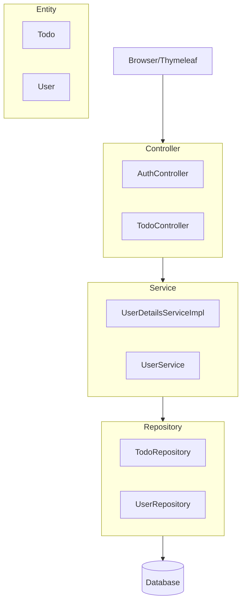
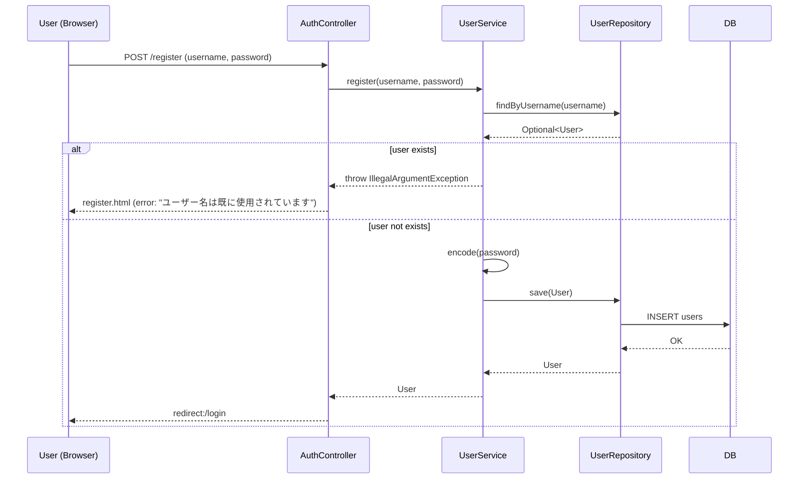
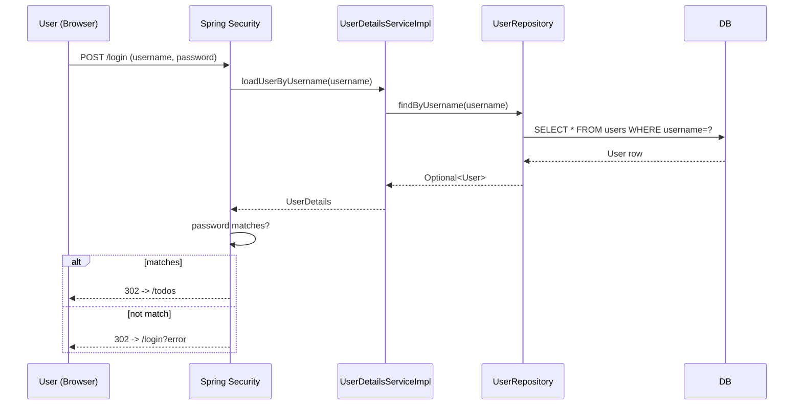
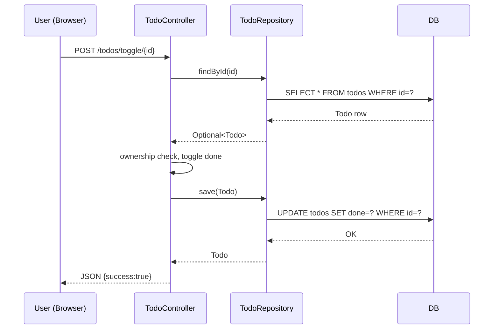
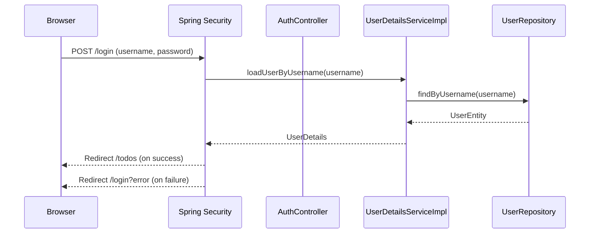
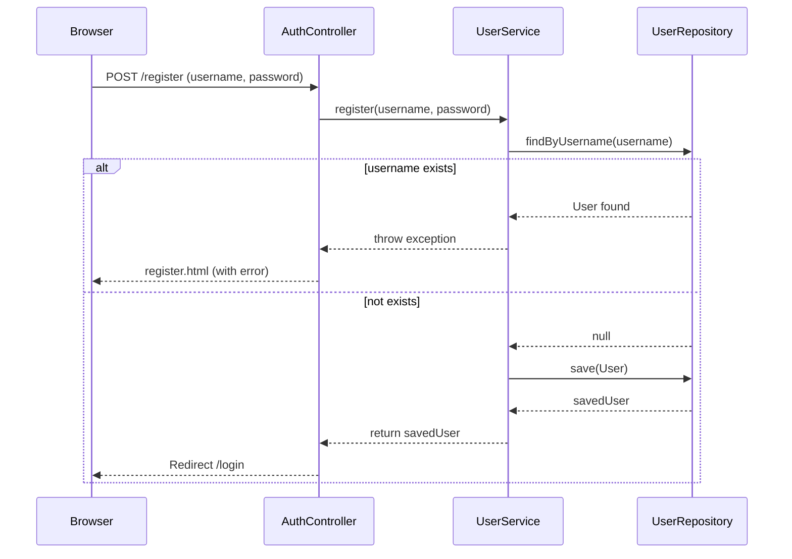
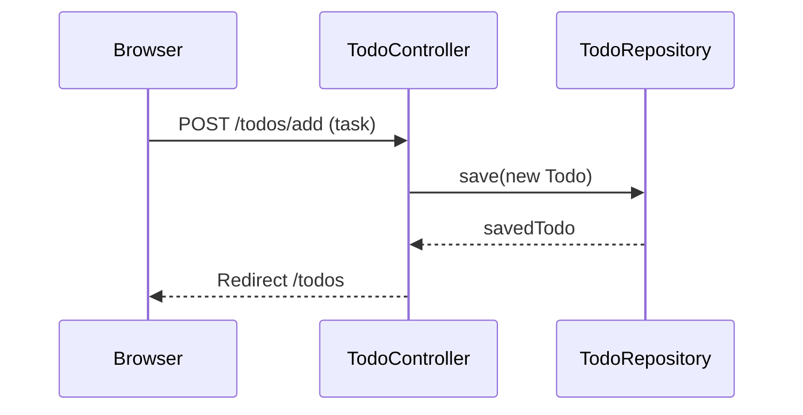
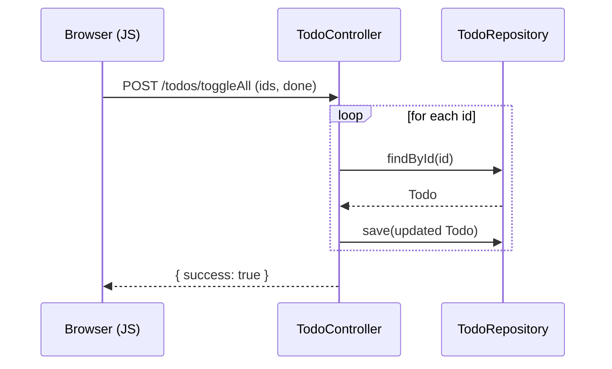

# Project Architecture Overview

## 1) High-level Layers


## 2) Entity-Relationship (ER) Diagram
```mermaid
erDiagram
    Todo {
        Long id
        String task
        User user
        LocalDateTime createdAt
    }
    User {
        Long id
        String username
        String password
    }
    User ||--oTodo : has
```

## 3) HTTP Endpoints
# Endpoints
## AuthController  (base: ``)
## TodoController  (base: `/todos`)

## 4) Source Tree (trimmed)

```
todo_demo_fixed/
  └─ .git/
    └─ HEAD
    └─ config
    └─ description
    └─ hooks/
      └─ applypatch-msg.sample
      └─ commit-msg.sample
      └─ fsmonitor-watchman.sample
      └─ post-update.sample
      └─ pre-applypatch.sample
      └─ pre-commit.sample
      └─ pre-merge-commit.sample
      └─ pre-push.sample
      └─ pre-rebase.sample
      └─ pre-receive.sample
      └─ prepare-commit-msg.sample
      └─ push-to-checkout.sample
      └─ sendemail-validate.sample
      └─ update.sample
    └─ index
    └─ info/
      └─ exclude
    └─ logs/
      └─ HEAD
      └─ refs/
        └─ heads/
          └─ main
        └─ remotes/
          └─ origin/
            └─ HEAD
    └─ objects/
      └─ info/
      └─ pack/
        └─ pack-c5c994c22eff137c22c611512c53aaf7fd5b4a0e.idx
        └─ pack-c5c994c22eff137c22c611512c53aaf7fd5b4a0e.pack
        └─ pack-c5c994c22eff137c22c611512c53aaf7fd5b4a0e.rev
    └─ packed-refs
    └─ refs/
      └─ heads/
        └─ main
      └─ remotes/
        └─ origin/
          └─ HEAD
      └─ tags/
  └─ .gitattributes
  └─ .gitignore
  └─ .mvn/
    └─ wrapper/
      └─ maven-wrapper.properties
  └─ .vscode/
    └─ launch.json
    └─ settings.json
  └─ data/
    └─ todo_db.mv.db
    └─ todo_db.trace.db
  └─ mvnw
  └─ mvnw.cmd
  └─ pom.xml
  └─ src/
    └─ main/
      └─ java/
        └─ todo_demo/
          └─ TodoDemoApplication.java
          └─ config/
            └─ SecurityConfig.java
          └─ controller/
            └─ AuthController.java
            └─ TodoController.java
          └─ entity/
            └─ Todo.java
            └─ User.java
          └─ repository/
            └─ TodoRepository.java
            └─ UserRepository.java
          └─ service/
            └─ UserDetailsServiceImpl.java
            └─ UserService.java
      └─ resources/
        └─ application.properties
        └─ static/
          └─ css/
            └─ style.css
          └─ js/
            └─ todo.js
        └─ templates/
          └─ index.html
          └─ login.html
          └─ register.html
          └─ todos.html
    └─ test/
      └─ java/
        └─ todo_demo/
          └─ TodoDemoApplicationTests.java
  └─ target/
    └─ classes/
      └─ application.properties
      └─ static/
        └─ css/
          └─ style.css
        └─ js/
          └─ todo.js
      └─ templates/
        └─ index.html
        └─ login.html
        └─ register.html
        └─ todos.html
      └─ todo_demo/
        └─ TodoDemoApplication.class
        └─ config/
          └─ SecurityConfig.class
        └─ controller/
          └─ AuthController.class
          └─ TodoController$IdListRequest.class
          └─ TodoController$ToggleAllRequest.class
          └─ TodoController.class
        └─ entity/
          └─ Todo.class
          └─ User.class
        └─ repository/
          └─ TodoRepository.class
          └─ UserRepository.class
        └─ service/
          └─ UserDetailsServiceImpl.class
          └─ UserService.class
    └─ generated-sources/
      └─ annotations/
    └─ generated-test-sources/
      └─ test-annotations/
    └─ maven-archiver/
      └─ pom.properties
    └─ maven-status/
      └─ maven-compiler-plugin/
        └─ compile/
          └─ default-compile/
            └─ createdFiles.lst
            └─ inputFiles.lst
        └─ testCompile/
          └─ default-testCompile/
            └─ createdFiles.lst
            └─ inputFiles.lst
    └─ surefire-reports/
      └─ TEST-todo_demo.TodoDemoApplicationTests.xml
      └─ todo_demo.TodoDemoApplicationTests.txt
    └─ test-classes/
      └─ todo_demo/
        └─ TodoDemoApplicationTests.class
    └─ todo_demo-0.0.1-SNAPSHOT.jar
    └─ todo_demo-0.0.1-SNAPSHOT.jar.original
```

## 5) Key Sequences

### 5.1 Register User


### 5.2 Login (Spring Security)


### 5.3 Toggle Todo


## 6) Screen Transition Diagram

```mermaid
flowchart TD
    A[ログイン画面 login.html] -->|ログイン成功| B[TODO一覧 todos.html]
    A -->|未登録ユーザ→登録リンク| C[新規登録画面 register.html]
    C -->|登録成功| A
    C -->|登録失敗 (重複など)| C
    B -->|ログアウト| A
    B -->|追加/編集/削除/完了切替| B
```

## 7) Environment Architecture

```mermaid
flowchart LR
    Browser[ブラウザ
(HTML, CSS, JS)] -->|HTTP/HTTPS| SpringBoot[Spring Boot App]
    SpringBoot --> Controller[Controller層
(AuthController, TodoController)]
    Controller --> Service[Service層
(UserService, UserDetailsServiceImpl)]
    Service --> Repo[Repository層
(UserRepository, TodoRepository)]
    Repo --> DB[(H2 Database / RDB)]
    SpringBoot --> Static[Staticリソース
(JS, CSS, images)]
    Security[Spring Security
認証/認可] --> Controller
```

## 8) Detailed API Specification

### Authentication
- `GET /login`
  - Show login form.
- `POST /login`
  - Handled by Spring Security filter, not controller.
  - Request: `application/x-www-form-urlencoded`
    - `username`, `password`
  - Response: redirect to `/todos` on success, `/login?error` on failure.

- `GET /register`
  - Show register form.
- `POST /register`
  - Request: `application/x-www-form-urlencoded`
    - `username` (string)
    - `password` (string)
  - Response:
    - 302 redirect to `/login` on success.
    - Re-render `register.html` with error message on failure.

### Todos
- `GET /todos`
  - Render todos.html with model attribute `todos: List<Todo>`.

- `POST /todos/add`
  - Add new Todo.
  - Request: form `{ task: string }`
  - Response: redirect to `/todos`.

- `POST /todos/toggle/{id}`
  - Toggle completion.
  - Request: path variable id.
  - Response: JSON `{ success: true }`

- `POST /todos/update/{id}`
  - Update todo text.
  - Request: JSON `{ task: string }`
  - Response: JSON `{ success: true }`

- `POST /todos/delete/{id}`
  - Delete a todo by id.
  - Response: JSON `{ success: true }`

- `POST /todos/toggleAll`
  - Toggle all todos to done/undone.
  - Request: JSON `{ ids: [number], done: boolean }`
  - Response: JSON `{ success: true }`

- `POST /todos/deleteSelected`
  - Delete multiple todos.
  - Request: JSON `{ ids: [number] }`
  - Response: JSON `{ success: true }`

## 9) Validation Specification

### User Registration
- Username
  - Required (not null, not blank)
  - Unique (duplicate check against DB)
  - Length: 3–50 chars (recommend)
- Password
  - Required
  - Length: 6–100 chars (recommend)
  - Stored with BCrypt hash

### Todo
- Task
  - Required (not blank)
  - Length: up to 255 chars
- Ownership
  - Must belong to logged-in user
- ID
  - Positive integer, existing record only

```


## 10) Sequence Diagrams

### Login Process


### Register Process


### Add Todo Process


### Toggle All Todos

