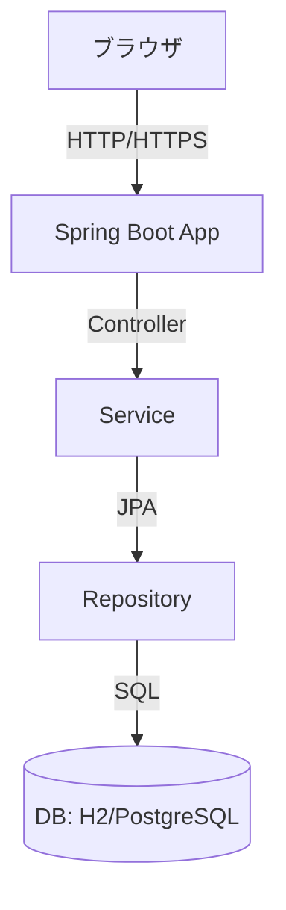

# TODO Demo アーキテクチャドキュメント

## 目次
- [1. アーキテクチャ図](#1-アーキテクチャ図)
- [2. ER 図](#2-er-図)
- [3. 画面遷移図](#3-画面遷移図)
- [4. 環境構成図](#4-環境構成図)
- [5. API 仕様](#5-api-仕様)
- [6. バリデーション仕様](#6-バリデーション仕様)
- [7. シーケンス図](#7-シーケンス図)

---

## 1. アーキテクチャ図

...（中略: ER 図, 画面遷移図, API仕様, バリデーション仕様, シーケンス図など）
